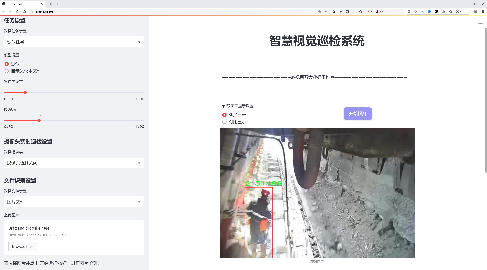
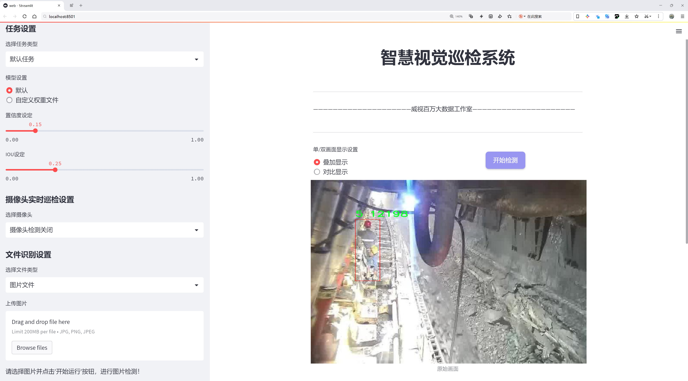
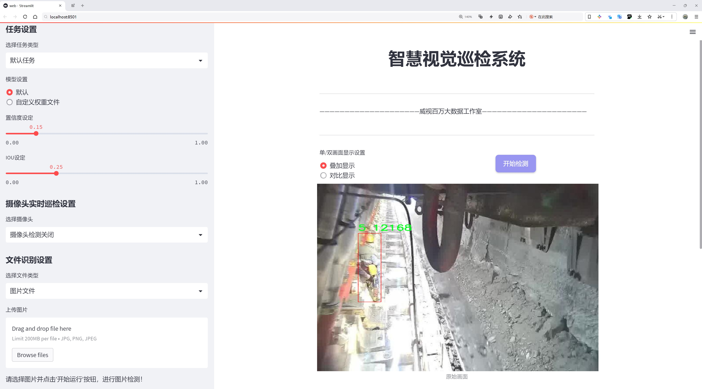
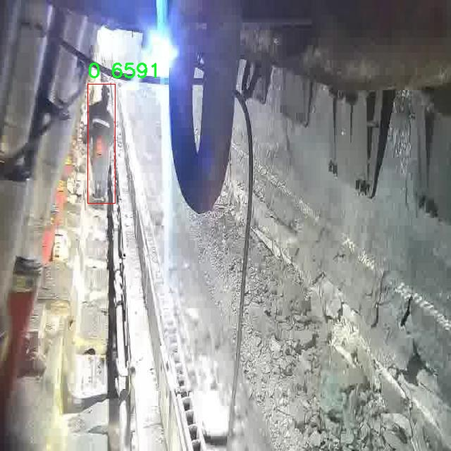
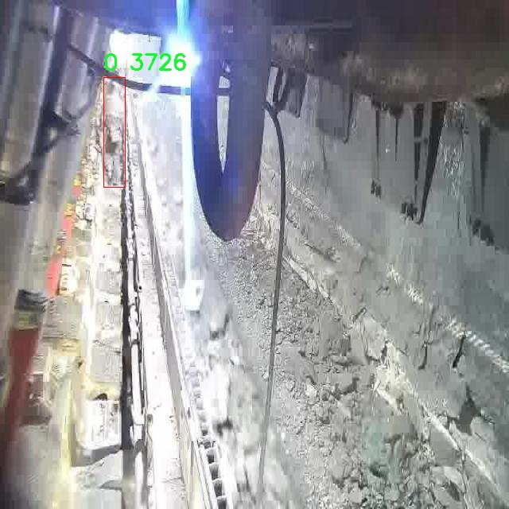
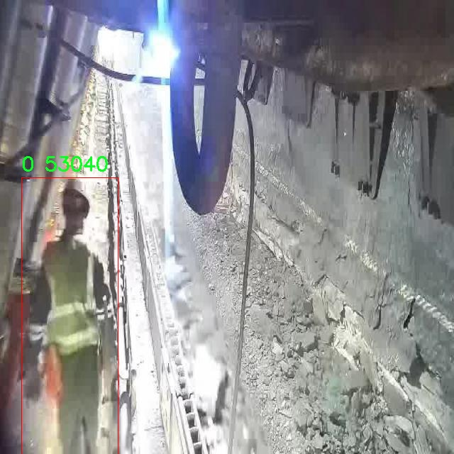
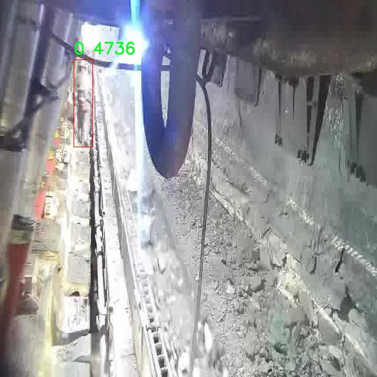
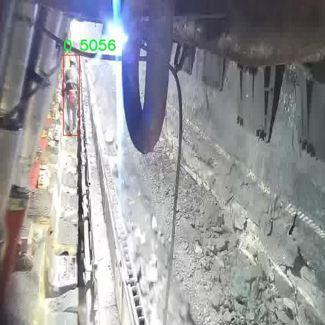

# 矿洞场景目标检测检测系统源码分享
 # [一条龙教学YOLOV8标注好的数据集一键训练_70+全套改进创新点发刊_Web前端展示]

### 1.研究背景与意义

项目参考[AAAI Association for the Advancement of Artificial Intelligence](https://gitee.com/qunmasj/projects)

研究背景与意义

随着矿业的快速发展，矿洞场景的安全管理与监测变得愈发重要。矿洞环境复杂多变，光照条件差、空间狭小、障碍物众多，给目标检测带来了极大的挑战。传统的目标检测方法在此类场景下往往表现不佳，难以满足实时监测和自动化管理的需求。因此，开发一种高效、准确的矿洞场景目标检测系统显得尤为重要。

近年来，深度学习技术的迅猛发展为目标检测提供了新的解决方案。YOLO（You Only Look Once）系列模型因其优越的实时性和准确性，已成为目标检测领域的主流方法。YOLOv8作为该系列的最新版本，结合了更为先进的网络结构和训练策略，能够在保持高检测精度的同时，实现更快的推理速度。然而，尽管YOLOv8在多种场景下表现出色，但在特定的矿洞环境中，仍然面临着诸如目标遮挡、类间相似性以及复杂背景等问题。因此，针对矿洞场景的特点，对YOLOv8进行改进和优化，具有重要的理论和实践意义。

本研究所使用的数据集包含2906张图像，涵盖了7个类别的目标。这些类别可能包括矿工、矿车、设备、标志、障碍物等，代表了矿洞环境中可能出现的各种重要目标。通过对这些数据的深入分析和处理，可以为模型的训练提供丰富的样本，进而提升模型在特定场景下的检测能力。此外，数据集的多样性和复杂性也为模型的泛化能力提供了良好的基础，使其能够适应不同的矿洞环境和条件。

在研究过程中，我们将通过改进YOLOv8的网络结构、优化训练策略以及引入数据增强技术，提升模型在矿洞场景下的目标检测性能。具体而言，可以通过调整网络的特征提取层、引入注意力机制以及改进损失函数等方式，增强模型对小目标和遮挡目标的检测能力。同时，利用迁移学习和自监督学习等方法，可以有效减少对标注数据的依赖，提高模型的训练效率。

本研究的意义不仅在于提升矿洞场景下的目标检测精度，更在于为矿业安全管理提供一种智能化的解决方案。通过实现对矿洞环境的实时监测和自动识别，可以有效降低事故发生的风险，提高矿工的安全保障。此外，研究成果还可以为其他复杂环境下的目标检测提供借鉴，推动相关领域的技术进步。

综上所述，基于改进YOLOv8的矿洞场景目标检测系统的研究，不仅具有重要的学术价值，也具备广泛的应用前景。通过深入探索和创新，期望能够为矿业安全管理和智能监测技术的发展贡献一份力量。

### 2.图片演示







##### 注意：由于此博客编辑较早，上面“2.图片演示”和“3.视频演示”展示的系统图片或者视频可能为老版本，新版本在老版本的基础上升级如下：（实际效果以升级的新版本为准）

  （1）适配了YOLOV8的“目标检测”模型和“实例分割”模型，通过加载相应的权重（.pt）文件即可自适应加载模型。

  （2）支持“图片识别”、“视频识别”、“摄像头实时识别”三种识别模式。

  （3）支持“图片识别”、“视频识别”、“摄像头实时识别”三种识别结果保存导出，解决手动导出（容易卡顿出现爆内存）存在的问题，识别完自动保存结果并导出到。

  （4）支持Web前端系统中的标题、背景图等自定义修改，后面提供修改教程。

  另外本项目提供训练的数据集和训练教程,暂不提供权重文件（best.pt）,需要您按照教程进行训练后实现图片演示和Web前端界面演示的效果。

### 3.视频演示

[3.1 视频演示](https://www.bilibili.com/video/BV1rmW6eiErp/?vd_source=ff015de2d29cbe2a9cdbfa7064407a08)

### 4.数据集信息展示

数据集信息展示

在本研究中，我们使用了一个专门为矿洞场景目标检测系统训练而设计的数据集。该数据集包含2906幅图像，旨在提升YOLOv8模型在复杂矿洞环境中的目标检测能力。数据集的丰富性和多样性为模型的训练提供了坚实的基础，使其能够在实际应用中更好地识别和定位矿洞中的各种目标。

该数据集共分为7个类别，涵盖了矿洞场景中可能出现的不同物体。这些类别的细分不仅有助于提高模型的检测精度，也为后续的分析和研究提供了更为详细的分类信息。每个类别都经过精心标注，确保数据的准确性和可靠性。这种细致的标注工作为训练模型提供了高质量的输入，能够有效地减少误检和漏检的情况。

在数据集的构建过程中，图像的选择和处理至关重要。我们确保所选图像涵盖了矿洞的不同区域和环境条件，包括光照变化、物体遮挡以及不同的矿洞结构。这种多样性使得模型在面对真实世界的复杂情况时，能够展现出更强的适应能力和鲁棒性。此外，数据集中的图像还包括了不同角度和距离的拍摄，进一步增强了模型的泛化能力。

数据集的获取和使用遵循了CC BY 4.0的许可协议，这意味着研究人员可以在适当的引用下自由使用和修改数据集。这一开放的许可不仅促进了学术界的合作与交流，也为后续的研究提供了便利。通过这种方式，其他研究者可以在此基础上进行更深入的探索，推动矿洞场景目标检测技术的发展。

为了更好地利用这一数据集，我们将其与YOLOv8模型相结合，进行系统的训练和测试。YOLOv8作为一种先进的目标检测算法，其高效的特征提取和实时检测能力使其成为本研究的理想选择。通过对2906幅图像的训练，模型能够学习到矿洞场景中目标的特征，从而在实际应用中实现高效的目标检测。

总之，这一数据集为矿洞场景目标检测系统的研究提供了重要的支持。通过对数据集的深入分析和合理利用，我们期望能够显著提升YOLOv8在矿洞环境中的检测性能，为矿业安全和自动化作业提供更为可靠的技术保障。随着研究的深入，我们相信这一数据集将为矿洞场景目标检测领域带来新的突破和进展。











### 5.全套项目环境部署视频教程（零基础手把手教学）

[5.1 环境部署教程链接（零基础手把手教学）](https://www.ixigua.com/7404473917358506534?logTag=c807d0cbc21c0ef59de5)


[5.2 安装Python虚拟环境创建和依赖库安装视频教程链接（零基础手把手教学）](https://www.ixigua.com/7404474678003106304?logTag=1f1041108cd1f708b01a)

### 6.手把手YOLOV8训练视频教程（零基础小白有手就能学会）

[6.1 环境部署教程链接（零基础手把手教学）](https://www.ixigua.com/7404477157818401292?logTag=d31a2dfd1983c9668658)

### 7.70+种全套YOLOV8创新点代码加载调参视频教程（一键加载写好的改进模型的配置文件）

[7.1 环境部署教程链接（零基础手把手教学）](https://www.ixigua.com/7404478314661806627?logTag=29066f8288e3f4eea3a4)

### 8.70+种全套YOLOV8创新点原理讲解（非科班也可以轻松写刊发刊，V10版本正在科研待更新）

由于篇幅限制，每个创新点的具体原理讲解就不一一展开，具体见下列网址中的创新点对应子项目的技术原理博客网址【Blog】：


[8.1 70+种全套YOLOV8创新点原理讲解链接](https://gitee.com/qunmasj/good)

### 9.系统功能展示（检测对象为举例，实际内容以本项目数据集为准）

图1.系统支持检测结果表格显示

  图2.系统支持置信度和IOU阈值手动调节

  图3.系统支持自定义加载权重文件best.pt(需要你通过步骤5中训练获得)

  图4.系统支持摄像头实时识别

  图5.系统支持图片识别

  图6.系统支持视频识别

  图7.系统支持识别结果文件自动保存

  图8.系统支持Excel导出检测结果数据


### 10.原始YOLOV8算法原理

原始YOLOv8算法原理

YOLOv8算法是Ultralytics公司在2023年推出的目标检测模型，它在YOLO系列的基础上进行了显著的改进和创新，旨在提升目标检测的速度和精度。YOLOv8的设计理念是快速、准确且易于使用，使其在目标检测、图像分割和图像分类等任务中表现出色。该算法的网络结构主要由输入层、主干网络、特征融合层和解耦头组成，具有较强的灵活性和适应性。

首先，YOLOv8的输入层采用了640x640的标准图像尺寸，但在实际应用中，图像的长宽比往往各不相同。为了解决这一问题，YOLOv8在推理时采用自适应图像缩放策略。该策略通过将图像的长边按比例缩小到640像素，然后对短边进行填充，从而最大限度地减少信息冗余。这种方法不仅提高了目标检测的速度，还保持了模型对不同尺寸目标的敏感性。此外，在训练阶段，YOLOv8引入了Mosaic数据增强技术，该技术通过随机选择四张图像进行缩放和拼接，生成新的训练样本。这种增强方式有效地提高了模型的鲁棒性和泛化能力，使其能够更好地适应不同的场景和目标。

在主干网络部分，YOLOv8对传统的C3模块进行了替换，采用了C2F模块。C2F模块的设计灵感来源于YOLOv7中的ELAN模块，增加了更多的跳层连接，从而获得更丰富的梯度流信息。这种结构的优势在于能够有效缓解深层网络中的梯度消失问题，同时保持模型的轻量化。C2F模块通过引入多个分支和瓶颈结构，能够提取到更为细致的特征信息，进而提升目标检测的精度。

在特征融合层，YOLOv8采用了PAN-FPN结构，旨在充分融合不同层次的特征信息。该结构通过自下而上的方式，将高层特征与中层和浅层特征进行融合，从而增强了模型对多尺度目标的检测能力。YOLOv8在这一部分的创新之处在于，去除了传统上采样阶段前的卷积连接层，直接将高层特征进行上采样并与中层特征进行拼接。这种设计不仅简化了网络结构，还提高了特征融合的效率，使得每一层的特征图都能够包含丰富的语义信息和细节信息。

在头部网络方面，YOLOv8的最大变化在于从Coupled-Head（耦合头）转变为Decoupled-Head（解耦头）。这一设计使得检测和分类的卷积操作得以分开进行，分别处理目标的类别预测和边界框回归。具体而言，输入的特征图首先通过两个1x1的卷积模块进行降维，然后分别输出类别预测和边界框位置的预测。这种解耦设计不仅提高了模型的收敛速度，还增强了预测的精度。此外，YOLOv8在损失函数的设计上也进行了创新，采用了Distribution Focal Loss（DFL）和CIoU Loss的组合，旨在使模型更快地聚焦于标签附近的区域，提高目标检测的准确性。

YOLOv8的另一个重要创新是采用了Anchor-Free的方法，抛弃了传统的Anchor-Based思想。以往的Anchor-Based方法需要预设多个锚框，以便对目标进行定位和分类，这在处理多样化目标时往往显得不够灵活。而YOLOv8通过将目标检测转化为关键点检测，避免了对锚框的依赖，简化了模型的结构，提高了泛化能力。这种方法不仅减少了计算复杂度，还使得模型在面对不同尺寸和形状的目标时能够更为自适应。

在模型的训练过程中，YOLOv8还引入了Task Alignment Learning（TAL）机制，以提升样本匹配的效果。该机制通过对正负样本进行对齐，使得模型在训练时能够更好地理解目标的特征，从而提高分类和定位的准确性。此外，YOLOv8在处理样本不平衡问题时，采用了Focal Loss作为分类损失函数，以有效应对正负样本数量不均的问题。

综上所述，YOLOv8算法通过对网络结构的优化、特征融合的增强以及创新的损失函数设计，显著提升了目标检测的性能。其灵活的输入处理、自适应的特征提取和高效的样本匹配机制，使得YOLOv8在各种目标检测任务中表现出色，具有广泛的应用前景。随着YOLOv8的推广和应用，未来在实时目标检测、自动驾驶、安防监控等领域，YOLOv8无疑将发挥更大的作用。


### 11.项目核心源码讲解（再也不用担心看不懂代码逻辑）

#### 11.1 web.py

以下是对您提供的代码进行的逐文件分析，保留了最核心的部分，并添加了详细的中文注释：

```python
import random
import cv2
import numpy as np
import streamlit as st
from PIL import ImageFont, ImageDraw, Image
from datetime import datetime

def draw_with_chinese(image, text, position, font_size=20, color=(255, 0, 0)):
    """
    在OpenCV图像上绘制中文文字
    """
    # 将图像从 OpenCV 格式（BGR）转换为 PIL 格式（RGB）
    image_pil = Image.fromarray(cv2.cvtColor(image, cv2.COLOR_BGR2RGB))
    draw = ImageDraw.Draw(image_pil)
    # 使用指定的字体
    font = ImageFont.truetype("simsun.ttc", font_size, encoding="unic")
    draw.text(position, text, font=font, fill=color)
    # 将图像从 PIL 格式（RGB）转换回 OpenCV 格式（BGR）
    return cv2.cvtColor(np.array(image_pil), cv2.COLOR_RGB2BGR)

def adjust_parameter(image_size, base_size=1000):
    """
    计算自适应参数，基于图片的最大尺寸
    """
    max_size = max(image_size)
    return max_size / base_size

def draw_detections(image, info, alpha=0.2):
    """
    在图像上绘制检测结果，包括边界框和标签
    """
    name, bbox, conf, cls_id, mask = info['class_name'], info['bbox'], info['score'], info['class_id'], info['mask']
    adjust_param = adjust_parameter(image.shape[:2])  # 获取自适应参数
    if mask is None:
        # 计算并绘制边界框
        x1, y1, x2, y2 = bbox
        aim_frame_area = (x2 - x1) * (y2 - y1)
        cv2.rectangle(image, (x1, y1), (x2, y2), color=(0, 0, 255), thickness=int(3*adjust_param))
        label_area = f"{name} {int(aim_frame_area)}"
        image = draw_with_chinese(image, label_area, (x1, y1 - int(30 * adjust_param)), font_size=int(35*adjust_param))
    else:
        # 计算并绘制mask的轮廓
        mask_points = np.concatenate(mask)
        aim_frame_area = calculate_polygon_area(mask_points)
        cv2.drawContours(image, [mask_points.astype(np.int32)], -1, (0, 0, 255), thickness=int(3*adjust_param))
        label_area = f"{name}  {int(aim_frame_area)}"
        x, y = np.min(mask_points, axis=0).astype(int)
        image = draw_with_chinese(image, label_area, (x, y - int(30 * adjust_param)), font_size=int(35*adjust_param))
    return image, aim_frame_area

def calculate_polygon_area(points):
    """
    计算多边形的面积，输入应为一个 Nx2 的numpy数组，表示多边形的顶点坐标
    """
    if len(points) < 3:  # 多边形至少需要3个顶点
        return 0
    return cv2.contourArea(points)

class Detection_UI:
    """
    检测系统类，负责界面和检测逻辑
    """
    def __init__(self):
        """
        初始化检测系统的参数
        """
        self.cls_name = []  # 类别标签列表
        self.colors = []  # 随机颜色分配
        self.model_type = None  # 模型类型
        self.conf_threshold = 0.15  # 置信度阈值
        self.iou_threshold = 0.5  # IOU阈值
        self.selected_camera = None  # 选定的摄像头
        self.uploaded_file = None  # 上传的文件
        self.detection_result = None  # 检测结果
        self.log_table_placeholder = None  # 结果表格显示区域

        # 初始化模型
        self.model = Web_Detector()  # 创建Detector模型实例
        self.model.load_model(model_path="weights/yolov8s.pt")  # 加载模型权重

    def process_camera_or_file(self):
        """
        处理摄像头或文件输入，根据用户选择的输入源处理并显示检测结果
        """
        if self.selected_camera is not None:
            # 处理摄像头输入
            cap = cv2.VideoCapture(self.selected_camera)
            while cap.isOpened():
                ret, frame = cap.read()
                if ret:
                    image, detInfo, _ = self.frame_process(frame)
                    # 显示处理后的图像
                    st.image(image, channels="BGR")
                else:
                    break
            cap.release()
        elif self.uploaded_file is not None:
            # 处理上传的文件
            source_img = self.uploaded_file.read()
            file_bytes = np.asarray(bytearray(source_img), dtype=np.uint8)
            image_ini = cv2.imdecode(file_bytes, 1)
            image, detInfo, _ = self.frame_process(image_ini)
            st.image(image, channels="BGR")

    def frame_process(self, image):
        """
        处理并预测单个图像帧的内容
        """
        pre_img = self.model.preprocess(image)  # 对图像进行预处理
        pred = self.model.predict(pre_img)  # 使用模型进行预测
        detInfo = []  # 初始化检测信息

        if pred is not None:
            for info in pred:
                image, area = draw_detections(image, info)  # 绘制检测结果
                detInfo.append(info)  # 记录检测信息

        return image, detInfo, []

# 实例化并运行应用
if __name__ == "__main__":
    app = Detection_UI()
    app.process_camera_or_file()  # 运行摄像头或文件处理
```

### 代码核心部分说明：
1. **draw_with_chinese**: 在图像上绘制中文文字的函数，使用PIL库处理中文字体。
2. **adjust_parameter**: 根据图像大小计算自适应参数。
3. **draw_detections**: 绘制检测结果，包括边界框和标签。
4. **calculate_polygon_area**: 计算多边形的面积。
5. **Detection_UI**: 检测系统的主类，负责初始化、处理输入和显示结果。
6. **process_camera_or_file**: 根据用户选择处理摄像头或文件输入。
7. **frame_process**: 处理单个图像帧，进行预测并绘制结果。

这些核心部分构成了一个简单的目标检测系统的基础，能够处理图像和视频流，并在图像上绘制检测结果。

这个 `web.py` 文件实现了一个基于 Streamlit 的视觉检测系统，主要用于处理图像和视频中的目标检测任务。以下是对代码的逐步分析和说明。

首先，文件导入了一系列必要的库，包括用于图像处理的 OpenCV 和 NumPy，以及用于构建 Web 应用的 Streamlit。还引入了一些自定义模块和工具函数，例如用于日志记录、模型加载和结果处理的工具。

在代码的开头，定义了几个辅助函数。`draw_with_chinese` 函数用于在 OpenCV 图像上绘制中文文本，使用了 Pillow 库来处理中文字体。`adjust_parameter` 函数根据图像的大小计算自适应参数，以便在绘制检测框时能够根据图像大小进行调整。`draw_detections` 函数则负责在图像上绘制检测结果，包括矩形框和标签。`calculate_polygon_area` 用于计算多边形的面积，`format_time` 用于格式化时间。

接下来，定义了一个 `Detection_UI` 类，作为整个检测系统的核心。该类的构造函数初始化了一些参数，包括类别标签、颜色、模型类型、置信度阈值、IOU 阈值等。它还设置了 Streamlit 的页面布局和样式，并加载了模型的权重。

在 `setup_sidebar` 方法中，设置了侧边栏的内容，包括任务类型选择、模型设置、摄像头选择和文件上传等。用户可以选择不同的模型和输入源（摄像头、图片或视频），并调整相关参数。

`process_camera_or_file` 方法处理用户选择的输入源。若选择了摄像头，则使用 OpenCV 捕获实时画面并进行目标检测；若选择了上传的文件，则读取文件并进行处理。该方法中还包括了进度条的更新和检测结果的保存。

`frame_process` 方法用于处理单个图像帧的内容，进行预处理、模型预测和后处理，并返回处理后的图像和检测信息。它会调用之前定义的绘制函数来在图像上标注检测结果。

`setupMainWindow` 方法构建了应用的主界面，包括显示模式选择、图像和结果表格的展示，以及开始检测的按钮。用户可以在此界面上启动检测任务并查看结果。

最后，文件的入口部分实例化 `Detection_UI` 类并运行应用。整体来看，这个文件构建了一个功能齐全的视觉检测系统，用户可以通过简单的界面进行实时检测和结果查看。

#### 11.2 ui.py

```python
import sys
import subprocess

def run_script(script_path):
    """
    使用当前 Python 环境运行指定的脚本。

    Args:
        script_path (str): 要运行的脚本路径

    Returns:
        None
    """
    # 获取当前 Python 解释器的路径
    python_path = sys.executable

    # 构建运行命令，使用 streamlit 运行指定的脚本
    command = f'"{python_path}" -m streamlit run "{script_path}"'

    # 执行命令并等待其完成
    result = subprocess.run(command, shell=True)
    
    # 检查命令执行结果，如果返回码不为0，表示出错
    if result.returncode != 0:
        print("脚本运行出错。")


# 主程序入口
if __name__ == "__main__":
    # 指定要运行的脚本路径
    script_path = "web.py"  # 这里可以替换为实际的脚本路径

    # 调用函数运行脚本
    run_script(script_path)
```

### 代码注释说明：
1. **导入模块**：
   - `sys`：用于访问与 Python 解释器相关的变量和函数。
   - `subprocess`：用于执行外部命令和程序。

2. **定义 `run_script` 函数**：
   - 该函数接受一个参数 `script_path`，表示要运行的 Python 脚本的路径。
   - 使用 `sys.executable` 获取当前 Python 解释器的路径，以确保在正确的环境中运行脚本。
   - 构建一个命令字符串，使用 `streamlit` 模块运行指定的脚本。
   - 使用 `subprocess.run` 执行命令，并等待其完成。
   - 检查命令的返回码，如果不为0，表示脚本运行出错，并打印错误信息。

3. **主程序入口**：
   - 使用 `if __name__ == "__main__":` 确保该代码块仅在直接运行该脚本时执行。
   - 指定要运行的脚本路径 `script_path`，并调用 `run_script` 函数执行该脚本。

这个程序文件名为 `ui.py`，主要功能是通过当前的 Python 环境来运行一个指定的脚本，具体是使用 Streamlit 框架来启动一个 Web 应用。

首先，程序导入了必要的模块，包括 `sys`、`os` 和 `subprocess`。其中，`sys` 模块用于访问与 Python 解释器相关的变量和函数，`os` 模块提供了与操作系统交互的功能，而 `subprocess` 模块则用于生成新的进程、连接到它们的输入/输出/错误管道，并获取它们的返回码。

接着，程序从 `QtFusion.path` 模块中导入了 `abs_path` 函数，这个函数的作用是获取文件的绝对路径。

在 `run_script` 函数中，首先定义了一个参数 `script_path`，它是要运行的脚本的路径。函数内部首先获取当前 Python 解释器的路径，并将其存储在 `python_path` 变量中。然后，构建一个命令字符串，命令的格式是使用 Python 解释器运行 Streamlit，并指定要运行的脚本路径。接下来，使用 `subprocess.run` 方法执行这个命令，`shell=True` 参数表示在 shell 中执行命令。

如果脚本运行出现错误，`result.returncode` 将不等于 0，程序会打印出“脚本运行出错”的提示信息。

在文件的最后部分，使用 `if __name__ == "__main__":` 来确保只有在直接运行该文件时才会执行下面的代码。在这里，首先调用 `abs_path` 函数来获取 `web.py` 脚本的绝对路径，并将其赋值给 `script_path` 变量。最后，调用 `run_script` 函数来运行指定的脚本。

总体来说，这个程序的主要功能是简化通过 Streamlit 启动 Web 应用的过程，使得用户只需指定脚本路径即可方便地运行。

#### 11.3 ultralytics\engine\model.py

以下是代码中最核心的部分，并附上详细的中文注释：

```python
class Model(nn.Module):
    """
    统一所有模型API的基础类。

    参数:
        model (str, Path): 要加载或创建的模型文件路径。
        task (Any, optional): YOLO模型的任务类型。默认为None。

    属性:
        predictor (Any): 预测器对象。
        model (Any): 模型对象。
        trainer (Any): 训练器对象。
        task (str): 模型任务类型。
        ckpt (Any): 如果模型是从*.pt文件加载的检查点对象。
        cfg (str): 如果从*.yaml文件加载的模型配置。
        ckpt_path (str): 检查点文件路径。
        overrides (dict): 训练器对象的覆盖参数。
        metrics (Any): 用于度量的数据。
    """

    def __init__(self, model: Union[str, Path] = "yolov8n.pt", task=None, verbose=False) -> None:
        """
        初始化YOLO模型。

        参数:
            model (Union[str, Path], optional): 要加载或创建的模型路径或名称。默认为'yolov8n.pt'。
            task (Any, optional): YOLO模型的任务类型。默认为None。
            verbose (bool, optional): 是否启用详细模式。
        """
        super().__init__()
        self.predictor = None  # 预测器对象
        self.model = None  # 模型对象
        self.trainer = None  # 训练器对象
        self.task = task  # 任务类型
        self.model_name = model = str(model).strip()  # 去除模型名称的空格

        # 检查是否为Ultralytics HUB模型
        if self.is_hub_model(model):
            self.session = self._get_hub_session(model)  # 获取HUB会话
            model = self.session.model_file  # 从HUB获取模型文件

        # 加载或创建新的YOLO模型
        model = checks.check_model_file_from_stem(model)  # 检查模型文件名
        if Path(model).suffix in (".yaml", ".yml"):
            self._new(model, task=task, verbose=verbose)  # 从配置文件创建新模型
        else:
            self._load(model, task=task)  # 从权重文件加载模型

        self.model_name = model  # 更新模型名称

    def predict(self, source=None, stream=False, predictor=None, **kwargs):
        """
        使用YOLO模型进行预测。

        参数:
            source (str | int | PIL | np.ndarray): 要进行预测的图像源。
            stream (bool): 是否流式传输预测结果。默认为False。
            predictor (BasePredictor): 自定义预测器。
            **kwargs : 传递给预测器的其他关键字参数。

        返回:
            (List[ultralytics.engine.results.Results]): 预测结果列表。
        """
        if source is None:
            source = ASSETS  # 如果没有提供源，则使用默认资产
            LOGGER.warning(f"WARNING ⚠️ 'source' is missing. Using 'source={source}'.")

        # 处理预测器的初始化和参数设置
        if not self.predictor:
            self.predictor = predictor or self._smart_load("predictor")(overrides=kwargs)
            self.predictor.setup_model(model=self.model)
        return self.predictor(source=source, stream=stream)  # 返回预测结果

    def _load(self, weights: str, task=None):
        """
        从权重文件加载模型并推断任务类型。

        参数:
            weights (str): 要加载的模型检查点。
            task (str | None): 模型任务。
        """
        suffix = Path(weights).suffix
        if suffix == ".pt":
            self.model, self.ckpt = attempt_load_one_weight(weights)  # 加载权重
            self.task = self.model.args["task"]  # 获取任务类型
        else:
            weights = checks.check_file(weights)  # 检查文件
            self.model, self.ckpt = weights, None
            self.task = task or guess_model_task(weights)  # 推断任务类型

    def is_hub_model(self, model):
        """检查提供的模型是否为HUB模型。"""
        return any(
            (
                model.startswith(f"{HUB_WEB_ROOT}/models/"),  # 检查是否为HUB模型URL
                len(model) == 20 and not Path(model).exists(),  # 检查模型ID
            )
        )

    def _new(self, cfg: str, task=None, model=None, verbose=False):
        """
        初始化新模型并推断任务类型。

        参数:
            cfg (str): 模型配置文件。
            task (str | None): 模型任务。
            model (BaseModel): 自定义模型。
            verbose (bool): 加载时显示模型信息。
        """
        cfg_dict = yaml_model_load(cfg)  # 加载配置文件
        self.cfg = cfg
        self.task = task or guess_model_task(cfg_dict)  # 推断任务类型
        self.model = (model or self._smart_load("model"))(cfg_dict)  # 创建模型

    # 其他方法和属性省略
```

### 代码核心部分解释
1. **Model类**: 这是YOLO模型的基础类，统一了模型的API，提供了加载、预测、训练等功能。
2. **__init__方法**: 初始化模型，支持从文件加载模型或创建新模型，并处理HUB模型和Triton模型的特殊情况。
3. **predict方法**: 进行预测的核心方法，处理输入源和预测器的初始化。
4. **_load方法**: 从权重文件加载模型，推断任务类型。
5. **is_hub_model方法**: 检查给定的模型是否为HUB模型。
6. **_new方法**: 从配置文件初始化新模型并推断任务类型。

以上是代码的核心部分及其详细注释，帮助理解YOLO模型的实现和使用。

这个程序文件是Ultralytics YOLO模型的核心实现部分，主要定义了一个名为`Model`的类，该类用于统一处理YOLO模型的各种操作。文件中包含了模型的初始化、加载、预测、训练、验证等功能。

在`Model`类的构造函数中，首先会初始化一些属性，例如模型的路径、任务类型、训练器、检查点等。构造函数会根据提供的模型路径判断模型的类型，支持从Ultralytics HUB加载模型或从本地文件加载模型。对于模型的配置文件（如`.yaml`），会调用`_new`方法进行初始化；而对于权重文件（如`.pt`），则调用`_load`方法进行加载。

`Model`类提供了多种方法，最重要的包括`predict`和`train`。`predict`方法用于执行目标检测，接受多种输入源（如图片路径、视频流等），并返回预测结果。`train`方法则用于在给定的数据集上训练模型，支持从Ultralytics HUB获取训练参数。

此外，类中还定义了一些辅助方法，例如`reset_weights`用于重置模型参数，`info`用于输出模型信息，`fuse`用于融合模型层以加快推理速度，`val`用于验证模型性能，`export`用于导出模型到其他格式等。

类中还实现了对PyTorch模型的检查，确保加载的模型是有效的PyTorch模型，并提供了回调机制，允许用户在训练和预测过程中添加自定义的回调函数。

最后，`task_map`属性是一个未实现的方法，用户需要根据具体任务提供相应的映射，以便于加载不同任务所需的模型、训练器和预测器。

总体来说，这个文件为YOLO模型的使用提供了一个统一的接口，简化了模型的加载、训练和预测过程。

#### 11.4 ultralytics\utils\autobatch.py

以下是经过简化和注释的核心代码部分：

```python
import numpy as np
import torch
from ultralytics.utils import LOGGER, colorstr
from ultralytics.utils.torch_utils import profile

def check_train_batch_size(model, imgsz=640, amp=True):
    """
    检查YOLO模型的训练批量大小。
    
    参数:
        model (torch.nn.Module): 要检查批量大小的YOLO模型。
        imgsz (int): 用于训练的图像大小。
        amp (bool): 如果为True，则使用自动混合精度（AMP）进行训练。

    返回:
        (int): 使用autobatch()函数计算的最佳批量大小。
    """
    with torch.cuda.amp.autocast(amp):
        return autobatch(model.train(), imgsz)  # 计算最佳批量大小

def autobatch(model, imgsz=640, fraction=0.60, batch_size=16):
    """
    自动估计YOLO模型的最佳批量大小，以使用可用CUDA内存的一部分。

    参数:
        model (torch.nn.Module): 要计算批量大小的YOLO模型。
        imgsz (int): YOLO模型的输入图像大小，默认为640。
        fraction (float): 要使用的可用CUDA内存的比例，默认为0.60。
        batch_size (int): 如果检测到错误，则使用的默认批量大小，默认为16。

    返回:
        (int): 最佳批量大小。
    """
    
    # 检查设备
    prefix = colorstr("AutoBatch: ")
    LOGGER.info(f"{prefix}计算imgsz={imgsz}的最佳批量大小")
    device = next(model.parameters()).device  # 获取模型所在设备
    if device.type == "cpu":
        LOGGER.info(f"{prefix}未检测到CUDA，使用默认CPU批量大小 {batch_size}")
        return batch_size

    # 检查CUDA内存
    gb = 1 << 30  # 字节转GiB (1024 ** 3)
    properties = torch.cuda.get_device_properties(device)  # 获取设备属性
    total_memory = properties.total_memory / gb  # GiB总内存
    reserved_memory = torch.cuda.memory_reserved(device) / gb  # GiB保留内存
    allocated_memory = torch.cuda.memory_allocated(device) / gb  # GiB已分配内存
    free_memory = total_memory - (reserved_memory + allocated_memory)  # GiB可用内存
    LOGGER.info(f"{prefix}{device} ({properties.name}) {total_memory:.2f}G总内存, {reserved_memory:.2f}G保留, {allocated_memory:.2f}G已分配, {free_memory:.2f}G可用")

    # 轮询批量大小
    batch_sizes = [1, 2, 4, 8, 16]
    try:
        img = [torch.empty(b, 3, imgsz, imgsz) for b in batch_sizes]  # 创建空图像张量
        results = profile(img, model, n=3, device=device)  # 轮询内存使用情况

        # 拟合解决方案
        memory_usage = [x[2] for x in results if x]  # 提取内存使用情况
        p = np.polyfit(batch_sizes[: len(memory_usage)], memory_usage, deg=1)  # 一次多项式拟合
        optimal_batch_size = int((free_memory * fraction - p[1]) / p[0])  # 计算最佳批量大小

        # 检查失败情况
        if None in results:
            fail_index = results.index(None)  # 第一个失败的索引
            if optimal_batch_size >= batch_sizes[fail_index]:  # 如果最佳批量大小超过失败点
                optimal_batch_size = batch_sizes[max(fail_index - 1, 0)]  # 选择安全点

        # 检查最佳批量大小是否在安全范围内
        if optimal_batch_size < 1 or optimal_batch_size > 1024:
            optimal_batch_size = batch_size
            LOGGER.info(f"{prefix}警告 ⚠️ 检测到CUDA异常，使用默认批量大小 {batch_size}.")

        # 记录实际使用的内存比例
        fraction_used = (np.polyval(p, optimal_batch_size) + reserved_memory + allocated_memory) / total_memory
        LOGGER.info(f"{prefix}使用批量大小 {optimal_batch_size}，内存使用 {total_memory * fraction_used:.2f}G/{total_memory:.2f}G ({fraction_used * 100:.0f}%) ✅")
        return optimal_batch_size
    except Exception as e:
        LOGGER.warning(f"{prefix}警告 ⚠️ 检测到错误: {e}, 使用默认批量大小 {batch_size}.")
        return batch_size
```

### 代码说明：
1. **check_train_batch_size**：该函数用于检查给定YOLO模型的最佳训练批量大小。它会使用`autobatch`函数来计算最优批量大小，并支持自动混合精度（AMP）。

2. **autobatch**：该函数自动估计YOLO模型的最佳批量大小，目的是利用可用CUDA内存的一部分。它会检查设备类型，获取CUDA内存的使用情况，并通过轮询不同的批量大小来确定最佳的批量大小。

3. **CUDA内存检查**：代码中包含了对CUDA内存的检查，包括总内存、保留内存和已分配内存的计算，以确保在选择批量大小时不会超出可用内存。

4. **异常处理**：在计算过程中，如果发生错误，将返回默认的批量大小，并记录警告信息。

这个程序文件的主要功能是估算在使用PyTorch进行YOLO模型训练时，最佳的批处理大小（batch size），以便合理利用可用的CUDA内存。文件中定义了几个函数，主要包括`check_train_batch_size`和`autobatch`。

在`check_train_batch_size`函数中，首先通过自动混合精度（AMP）上下文管理器来处理模型，然后调用`autobatch`函数来计算最佳的批处理大小。这个函数接受三个参数：模型、图像大小（默认为640）和一个布尔值表示是否使用AMP。返回值是计算出的最佳批处理大小。

`autobatch`函数是核心功能的实现。它首先检查模型所在的设备，如果设备是CPU，则直接返回默认的批处理大小。如果使用CUDA时，函数会检查CUDA的配置，确保`torch.backends.cudnn.benchmark`为False，以避免不必要的错误。

接下来，函数会获取CUDA设备的内存信息，包括总内存、已保留内存、已分配内存和可用内存，并将这些信息记录到日志中。然后，函数会定义一个批处理大小的列表，并创建相应大小的空张量以供后续分析。

通过调用`profile`函数，程序会对不同的批处理大小进行性能分析，获取每个批处理大小所需的内存。然后，使用一阶多项式拟合来估算最佳批处理大小，计算出的结果会与可用内存进行比较，以确保在安全范围内。如果计算出的批处理大小不在合理范围内，程序会回退到默认的批处理大小，并记录警告信息。

最后，函数会记录使用的批处理大小和实际使用的内存比例，并返回最佳批处理大小。如果在执行过程中发生异常，程序会捕获并记录警告，同时返回默认的批处理大小。

总的来说，这个文件的目的是通过动态计算，帮助用户在训练YOLO模型时合理配置批处理大小，以提高训练效率并避免内存溢出。

#### 11.5 train.py

以下是经过简化和注释的核心代码部分：

```python
import os
import torch
import yaml
from ultralytics import YOLO  # 导入YOLO模型库
from QtFusion.path import abs_path  # 导入路径处理工具

# 设置设备为GPU（如果可用），否则使用CPU
device = "0" if torch.cuda.is_available() else "cpu"

if __name__ == '__main__':  # 确保该模块被直接运行时才执行以下代码
    # 设置数据加载的工作进程数和批次大小
    workers = 1
    batch = 2

    # 数据集名称
    data_name = "data"
    # 获取数据集配置文件的绝对路径
    data_path = abs_path(f'datasets/{data_name}/{data_name}.yaml', path_type='current')
    
    # 获取数据集目录路径
    directory_path = os.path.dirname(data_path)
    
    # 读取YAML文件，保持原有顺序
    with open(data_path, 'r') as file:
        data = yaml.load(file, Loader=yaml.FullLoader)
    
    # 修改YAML文件中的路径项
    if 'path' in data:
        data['path'] = directory_path  # 更新路径为当前目录
        # 将修改后的数据写回YAML文件
        with open(data_path, 'w') as file:
            yaml.safe_dump(data, file, sort_keys=False)

    # 加载YOLOv8模型配置
    model = YOLO(model='./ultralytics/cfg/models/v8/yolov8s.yaml', task='detect')
    
    # 开始训练模型
    results2 = model.train(
        data=data_path,  # 指定训练数据的配置文件路径
        device=device,  # 指定训练设备
        workers=workers,  # 指定数据加载的工作进程数
        imgsz=640,  # 指定输入图像的大小为640x640
        epochs=100,  # 指定训练的轮数为100
        batch=batch,  # 指定每个批次的大小
        name='train_v8_' + data_name  # 指定训练任务的名称
    )
```

### 代码注释说明：
1. **导入库**：导入必要的库，包括操作系统库、PyTorch、YAML处理库和YOLO模型库。
2. **设备选择**：根据是否有可用的GPU来选择训练设备。
3. **主程序入口**：使用`if __name__ == '__main__':`确保代码只在直接运行时执行。
4. **参数设置**：设置数据加载的工作进程数和批次大小。
5. **数据集路径**：定义数据集名称并获取其配置文件的绝对路径。
6. **读取和修改YAML文件**：读取YAML文件内容，更新其中的路径项，并将修改后的内容写回文件。
7. **模型加载**：加载YOLOv8模型的配置文件。
8. **模型训练**：调用`train`方法开始训练，传入必要的参数，包括数据路径、设备、工作进程数、图像大小、训练轮数和批次大小。

这个程序文件 `train.py` 是一个用于训练 YOLOv8 模型的脚本。首先，它导入了必要的库，包括 `os`、`torch`、`yaml` 和 `ultralytics` 中的 YOLO 模型。程序通过检测 CUDA 是否可用来选择设备，如果可用则使用 GPU（设备编号为 "0"），否则使用 CPU。

在 `__main__` 块中，程序首先定义了一些训练参数，包括工作进程数（`workers`）和批次大小（`batch`）。接着，程序指定了数据集的名称为 "data"，并构建了数据集 YAML 文件的绝对路径。通过 `abs_path` 函数获取该路径后，程序将路径中的分隔符统一替换为 Unix 风格的斜杠。

程序接下来获取了数据集目录的路径，并打开指定的 YAML 文件以读取数据。使用 `yaml` 库读取 YAML 文件后，程序检查是否存在 `path` 项，如果存在，则将其修改为数据集的目录路径，并将修改后的数据写回到 YAML 文件中，以确保路径的正确性。

然后，程序加载了预训练的 YOLOv8 模型，指定了模型的配置文件路径。接下来，调用 `model.train` 方法开始训练模型。在训练过程中，程序指定了训练数据的配置文件路径、设备、工作进程数、输入图像的大小（640x640）、训练的 epoch 数（100）以及训练任务的名称（`train_v8_data`）。

整体来看，这个脚本的主要功能是配置并启动 YOLOv8 模型的训练过程，确保数据集路径的正确性，并通过指定的参数控制训练的各个方面。

#### 11.6 ultralytics\models\sam\predict.py

以下是经过简化和注释的核心代码部分，主要集中在 `Predictor` 类及其关键方法上。注释详细解释了每个方法的功能和参数。

```python
import numpy as np
import torch
import torch.nn.functional as F
import torchvision

from ultralytics.data.augment import LetterBox
from ultralytics.engine.predictor import BasePredictor
from ultralytics.engine.results import Results
from ultralytics.utils import ops
from .build import build_sam

class Predictor(BasePredictor):
    """
    Segment Anything Model (SAM) 的预测器类，继承自 BasePredictor。
    提供图像分割任务的模型推理接口，支持多种提示类型（如边界框、点和低分辨率掩码）。
    """

    def __init__(self, cfg=DEFAULT_CFG, overrides=None, _callbacks=None):
        """
        初始化预测器，设置配置、覆盖和回调。
        """
        if overrides is None:
            overrides = {}
        overrides.update(dict(task="segment", mode="predict", imgsz=1024))
        super().__init__(cfg, overrides, _callbacks)
        self.args.retina_masks = True  # 设置为True以获得最佳结果
        self.im = None  # 输入图像
        self.features = None  # 提取的图像特征
        self.prompts = {}  # 提示集合
        self.segment_all = False  # 控制是否分割所有对象

    def preprocess(self, im):
        """
        预处理输入图像以进行模型推理。
        将图像转换为张量格式并进行归一化。
        """
        if self.im is not None:
            return self.im
        not_tensor = not isinstance(im, torch.Tensor)
        if not_tensor:
            im = np.stack(self.pre_transform(im))
            im = im[..., ::-1].transpose((0, 3, 1, 2))  # BGR转RGB
            im = torch.from_numpy(im)

        im = im.to(self.device)  # 移动到设备
        im = im.half() if self.model.fp16 else im.float()  # 转换为半精度或单精度
        if not_tensor:
            im = (im - self.mean) / self.std  # 归一化
        return im

    def inference(self, im, bboxes=None, points=None, labels=None, masks=None, multimask_output=False):
        """
        基于给定的输入提示执行图像分割推理。
        使用 SAM 的架构进行实时和可提示的分割任务。
        """
        # 如果存在存储的提示，则覆盖输入提示
        bboxes = self.prompts.pop("bboxes", bboxes)
        points = self.prompts.pop("points", points)
        masks = self.prompts.pop("masks", masks)

        if all(i is None for i in [bboxes, points, masks]):
            return self.generate(im)  # 如果没有提示，则生成掩码

        return self.prompt_inference(im, bboxes, points, labels, masks, multimask_output)

    def prompt_inference(self, im, bboxes=None, points=None, labels=None, masks=None, multimask_output=False):
        """
        基于提示（如边界框、点和掩码）执行图像分割推理。
        """
        features = self.model.image_encoder(im) if self.features is None else self.features

        # 处理输入提示并进行掩码预测
        # 省略具体实现细节...

        return pred_masks.flatten(0, 1), pred_scores.flatten(0, 1)  # 返回预测的掩码和分数

    def generate(self, im, crop_n_layers=0, crop_overlap_ratio=512 / 1500, crop_downscale_factor=1):
        """
        使用 SAM 执行图像分割。
        可以选择在图像裁剪上进行更精细的分割。
        """
        self.segment_all = True
        ih, iw = im.shape[2:]  # 获取输入图像的高度和宽度
        # 生成裁剪区域...
        # 省略具体实现细节...

        return pred_masks, pred_scores, pred_bboxes  # 返回分割掩码、分数和边界框

    def setup_model(self, model, verbose=True):
        """
        初始化 SAM 模型以进行推理。
        """
        device = select_device(self.args.device, verbose=verbose)
        if model is None:
            model = build_sam(self.args.model)  # 构建模型
        model.eval()
        self.model = model.to(device)  # 移动模型到设备
        self.mean = torch.tensor([123.675, 116.28, 103.53]).view(-1, 1, 1).to(device)  # 归一化均值
        self.std = torch.tensor([58.395, 57.12, 57.375]).view(-1, 1, 1).to(device)  # 归一化标准差

    def postprocess(self, preds, img, orig_imgs):
        """
        后处理 SAM 的推理输出，生成对象检测掩码和边界框。
        """
        # 处理预测结果...
        # 省略具体实现细节...

        return results  # 返回结果列表
```

以上代码保留了 `Predictor` 类的核心结构和主要方法，详细注释了每个方法的功能和参数。省略了具体实现细节的部分可以根据需要进行补充。

这个程序文件 `ultralytics/models/sam/predict.py` 实现了使用“Segment Anything Model”（SAM）进行图像分割的预测逻辑。SAM 是一种先进的图像分割模型，具有可提示的分割和零样本性能。该模块包含了执行分割所需的预测逻辑和辅助工具，旨在支持高性能、实时的图像分割任务。

程序首先导入了一些必要的库，包括 NumPy、PyTorch 及其相关模块，以及一些 Ultralytics 框架中的工具和功能。接着定义了一个 `Predictor` 类，该类继承自 `BasePredictor`，并为图像分割任务提供了一个接口。这个类能够处理多种类型的提示，如边界框、点和低分辨率掩码。

在 `Predictor` 类的构造函数中，初始化了一些属性，包括配置字典、覆盖的参数、回调函数等。它还设置了一些特定于任务的设置，比如启用“retina_masks”以获得最佳结果。

`preprocess` 方法用于对输入图像进行预处理，包括应用变换和归一化。支持的输入格式包括 PyTorch 张量和 NumPy 数组列表。`pre_transform` 方法则执行初步的图像变换，以便为后续处理做好准备。

`inference` 方法是进行图像分割推理的核心，基于输入的提示（如边界框、点等）生成分割结果。如果没有提供提示，则调用 `generate` 方法进行全图分割。

`generate` 方法利用 SAM 的架构对整个图像进行分割，支持在图像裁剪上进行更精细的分割。它可以通过指定裁剪层数、重叠比例等参数来调整分割的细节。

`setup_model` 方法用于初始化 SAM 模型，分配设备并设置图像归一化所需的参数。`postprocess` 方法则在推理后处理输出，生成最终的分割掩码和边界框，并将它们缩放到原始图像大小。

此外，`setup_source` 方法配置了推理的数据源，`set_image` 方法用于设置单张图像进行推理。`set_prompts` 方法允许提前设置提示，而 `reset_image` 方法则重置图像和特征。

最后，`remove_small_regions` 方法用于对生成的分割掩码进行后处理，去除小的孤立区域和孔洞，并通过非极大值抑制（NMS）消除重复的边界框。

总体而言，这个文件提供了一个完整的框架，用于利用 SAM 模型进行高效的图像分割，支持多种输入提示和灵活的参数配置。

### 12.系统整体结构（节选）

### 整体功能和构架概括

该项目的整体功能是构建一个基于 YOLO 和 SAM 模型的视觉检测和分割系统。系统通过 Web 界面提供用户友好的交互，允许用户上传图像或视频进行目标检测和图像分割。核心模块包括模型的训练、推理和结果展示。项目的架构分为多个文件，每个文件负责特定的功能，确保代码的模块化和可维护性。

- **`web.py`**: 提供 Streamlit Web 应用的界面，允许用户上传图像和视频进行目标检测。
- **`ui.py`**: 启动 Streamlit 应用，简化运行过程。
- **`ultralytics/engine/model.py`**: 定义 YOLO 模型的核心功能，包括加载、训练和推理。
- **`ultralytics/utils/autobatch.py`**: 动态计算最佳批处理大小，以优化训练过程。
- **`train.py`**: 负责配置和启动 YOLO 模型的训练过程。
- **`ultralytics/models/sam/predict.py`**: 实现 SAM 模型的图像分割推理逻辑。
- **`ultralytics/nn/modules/transformer.py`**: 可能实现了与 Transformer 相关的模块，支持模型的结构。
- **`ultralytics/models/yolo/detect/__init__.py`**: 可能用于 YOLO 检测相关功能的初始化。
- **`ultralytics/utils/callbacks/neptune.py`**: 可能用于与 Neptune 集成的回调功能，支持训练过程的监控和日志记录。
- **`ultralytics/utils/tal.py`**: 可能实现了一些与训练、分析和日志记录相关的工具函数。

### 文件功能整理表

| 文件路径                                      | 功能描述                                                   |
|-------------------------------------------|----------------------------------------------------------|
| `web.py`                                 | 提供 Streamlit Web 应用界面，处理图像和视频的目标检测。         |
| `ui.py`                                  | 启动 Streamlit 应用，简化运行过程。                             |
| `ultralytics/engine/model.py`           | 定义 YOLO 模型的核心功能，包括加载、训练和推理。                |
| `ultralytics/utils/autobatch.py`        | 动态计算最佳批处理大小，以优化训练过程。                       |
| `train.py`                               | 配置和启动 YOLO 模型的训练过程。                             |
| `ultralytics/models/sam/predict.py`     | 实现 SAM 模型的图像分割推理逻辑。                             |
| `ultralytics/nn/modules/transformer.py` | 实现与 Transformer 相关的模块，支持模型结构。                 |
| `ultralytics/models/yolo/detect/__init__.py` | 初始化 YOLO 检测相关功能。                                   |
| `ultralytics/utils/callbacks/neptune.py` | 与 Neptune 集成的回调功能，支持训练过程的监控和日志记录。      |
| `ultralytics/utils/tal.py`              | 实现与训练、分析和日志记录相关的工具函数。                     |

以上表格整理了每个文件的功能，便于理解整个项目的结构和模块间的关系。

注意：由于此博客编辑较早，上面“11.项目核心源码讲解（再也不用担心看不懂代码逻辑）”中部分代码可能会优化升级，仅供参考学习，完整“训练源码”、“Web前端界面”和“70+种创新点源码”以“13.完整训练+Web前端界面+70+种创新点源码、数据集获取”的内容为准。

### 13.完整训练+Web前端界面+70+种创新点源码、数据集获取


https://mbd.pub/o/bread/ZpqVkpZt
